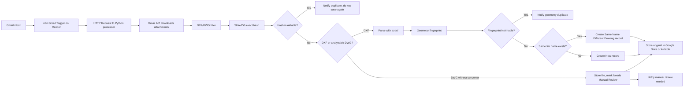

# Gmail Drawing Duplicate Checker

Free-first automation for customer emails containing DXF or DWG technical drawings.

This package is designed for:

- Gmail free account
- self-hosted n8n on Render
- Airtable free plan
- Google Drive free storage
- Python plus open-source `ezdxf`
- SHA-256 exact hashing
- geometry-based DXF fingerprinting
- Gmail, Slack free plan, or Telegram notifications

It deliberately does **not** trust file names. A drawing with the same name can still be graphically different, so the automation compares exact file bytes first and drawing content second. Because this uses free/open-source tools, it is a semi-automated assistant. Low-confidence files are flagged for manual review.

## How Codex Automations Fit In

Codex automations are recurring Codex jobs that can wake up on a schedule and run a task in a workspace. For this project, n8n is the right runtime orchestrator because it already handles Gmail triggers, workflow retries, credentials, and operational visibility. Codex is used to build and maintain the automation code; n8n runs the live workflow.

Questions to answer before production:

- Should original drawing files be stored in Google Drive links or Airtable attachment fields?
- Which notification channel should be used first: Gmail, Slack, or Telegram?
- Should DWG files always go to manual review, or will you install a free DWG-to-DXF converter in the Render deployment?
- For geometry duplicates, should the automation create no new Airtable record, or create an audit record showing that a customer resent an existing drawing?
- How often should n8n poll Gmail, knowing Render free services may sleep and delay execution?

## Free-First Architecture



The starter implementation uses n8n to detect new Gmail messages and call a Python webhook with the Gmail message ID. The Python service then downloads attachments through the Gmail API. This keeps n8n lightweight and avoids sending large binary payloads through the workflow.

## Render Constraints

Render free instances may sleep when inactive. That means Gmail processing can be delayed until n8n wakes up.

Render free local storage is temporary. Do not rely on the local filesystem for permanent drawing storage. Use:

- `STORAGE_BACKEND=google_drive` for production
- `STORAGE_BACKEND=local` only for local development or testing

Keep secrets in Render environment variables:

- `AIRTABLE_TOKEN`
- `AIRTABLE_BASE_ID`
- `WEBHOOK_SECRET`
- Google OAuth token or mounted secret files
- Slack or Telegram tokens, if used

## What The Automation Checks

For every DXF/DWG attachment:

1. Generates a SHA-256 hash from the original file bytes.
2. Searches Airtable for the same file hash.
3. If not found, parses DXF geometry using `ezdxf`.
4. Builds a normalized geometry fingerprint using entity types, coordinates, layers, blocks, text labels, dimensions where readable, and bounding box dimensions.
5. Searches Airtable for the same geometry fingerprint.
6. If the same file name exists but the geometry fingerprint differs, creates a `Same Name Different Drawing` record with a difference summary.
7. If parsing fails or confidence is low, creates a `Needs Manual Review` record.

## Airtable Setup

Create a table named `Drawings` or change `AIRTABLE_TABLE_NAME`.

Recommended fields:

| Field | Type |
| --- | --- |
| Customer Email | Single line text |
| Email Subject | Single line text |
| Received Date | Single line text or date |
| File Name | Single line text |
| File Type | Single select or single line text |
| Original File Link | URL, single line text, or attachment |
| File Hash | Single line text |
| Geometry Fingerprint | Single line text |
| Drawing Code / Product Code | Single line text |
| Status | Single select |
| Duplicate Match Record | Single line text |
| Difference Summary | Long text |
| Notes | Long text |
| Geometry Summary JSON | Long text |

Suggested `Status` options:

- `New`
- `Duplicate`
- `Same Name Different Drawing`
- `Needs Manual Review`

If `Original File Link` is an Airtable attachment field, set:

```text
AIRTABLE_FIELD_ORIGINAL_FILE_KIND=attachment
GOOGLE_DRIVE_SHARE_FILES=true
```

Airtable can attach a file only from a reachable URL. If you do not want Drive files public-by-link, keep `AIRTABLE_FIELD_ORIGINAL_FILE_KIND=url` and store the Drive link as text.

## Google And Gmail Setup

This uses free Google APIs with your own account.

1. Go to Google Cloud Console.
2. Create or select a project.
3. Enable Gmail API.
4. Enable Google Drive API if `STORAGE_BACKEND=google_drive`.
5. Configure OAuth consent for your account.
6. Create OAuth Client ID credentials for a desktop app.
7. Download the JSON file and save it as:

```text
credentials.json
```

8. Copy `.env.example` to `.env` and set `GOOGLE_CREDENTIALS_FILE=credentials.json`.
9. Run the one-time OAuth flow:

```bash
python -m src.main auth-gmail
```

This creates `token.json`. The OAuth scopes include Gmail read, Gmail send, and Drive file upload. If you previously generated `token.json` before Drive support was added, delete it and run the auth command again.

For Render deployment, copy the full `token.json` contents into the `GOOGLE_TOKEN_JSON` environment variable. This avoids depending on a secret file on Render disk.

## Environment Variables

Copy the sample:

```bash
cp .env.example .env
```

Minimum local setup:

```text
WEBHOOK_SECRET=replace-with-a-long-random-secret
AIRTABLE_TOKEN=pat_xxxxxxxxxxxxxxxxx
AIRTABLE_BASE_ID=appxxxxxxxxxxxxxx
AIRTABLE_TABLE_NAME=Drawings
STORAGE_BACKEND=google_drive
GOOGLE_DRIVE_FOLDER_ID=optional-folder-id
NOTIFICATION_MODE=gmail
NOTIFICATION_EMAIL_TO=you@example.com
```

Google Drive storage:

```text
STORAGE_BACKEND=google_drive
GOOGLE_DRIVE_FOLDER_ID=
GOOGLE_DRIVE_SHARE_FILES=false
```

Local development storage:

```text
STORAGE_BACKEND=local
STORAGE_DIR=storage
PUBLIC_FILE_BASE_URL=
```

Use local storage only for testing. On Render, local files can disappear.

## Install And Run Locally

From this folder:

```bash
python -m venv .venv
.venv\Scripts\activate
pip install -r requirements.txt
copy .env.example .env
python -m src.main auth-gmail
python -m src.main serve --host 0.0.0.0 --port 8000
```

Health check:

```bash
curl http://localhost:8000/health
```

Manual test with a Gmail message ID:

```bash
python -m src.main process-message 18cxxxxxxxxxxxxx
```

## n8n Setup On Render

Use [n8n/gmail-drawing-checker.workflow.json](n8n/gmail-drawing-checker.workflow.json) as a starter workflow.

Basic workflow:

1. Add a Gmail Trigger node.
2. Trigger on new incoming messages.
3. Add an HTTP Request node.
4. POST to the Python processor URL:

```text
https://your-python-processor.onrender.com/webhook/gmail-message
```

5. Send JSON body:

```json
{
  "message_id": "={{$json.id}}"
}
```

6. Add header:

```text
X-Webhook-Secret: your WEBHOOK_SECRET
```

If n8n and the Python processor run in the same custom container, use the internal host/port you configure. If they are separate Render services, use the public HTTPS URL.

See [RENDER_DEPLOYMENT.md](RENDER_DEPLOYMENT.md) for the free Render deployment pattern and environment variable notes.

## DWG Handling

DXF is parsed directly with `ezdxf`.

DWG is limited in a free-first stack. The automation does this:

1. Runs exact SHA-256 duplicate checking on every DWG.
2. Tries conversion only if `DWG_CONVERTER_COMMAND` is configured and available in the deployment environment.
3. If conversion is not available or fails, saves the file, marks it as `Needs Manual Review`, and sends a notification.

This avoids pretending that a DWG was compared graphically when it was not.

## Notification Modes

Gmail:

```text
NOTIFICATION_MODE=gmail
NOTIFICATION_EMAIL_TO=you@example.com
```

Slack free plan:

```text
NOTIFICATION_MODE=slack
SLACK_WEBHOOK_URL=https://hooks.slack.com/services/...
```

Telegram bot:

```text
NOTIFICATION_MODE=telegram
TELEGRAM_BOT_TOKEN=...
TELEGRAM_CHAT_ID=...
```

Silent processing:

```text
NOTIFICATION_MODE=none
```

## Important Limitations

- This is not a perfect CAD comparison engine.
- Geometry fingerprinting is useful for many DXF duplicates, but drawings with scaled, rotated, translated, nested, or exploded entities may require custom normalization.
- DWG graphical comparison requires conversion to DXF first.
- Free Render services can sleep, causing delayed processing.
- Render local storage is not permanent.
- Airtable free plan has record and attachment limits.
- Low-confidence cases are intentionally routed to manual review.

## Files

```text
Dockerfile                   Python processor container for Render
RENDER_DEPLOYMENT.md         Render setup notes for free-first deployment
src/main.py                  FastAPI webhook and CLI
src/automation.py            Core duplicate/new/manual-review logic
src/drawing_processor.py     DXF parsing, hashing, geometry fingerprinting
src/airtable_client.py       Airtable search/create/update functions
src/gmail_client.py          Google OAuth, Gmail attachment download, Gmail notifications
src/google_drive_client.py   Google Drive file upload
src/notifier.py              Gmail/Slack/Telegram notifications
src/storage.py               Google Drive or local original-file storage
n8n/*.json                   n8n workflow starter
```
